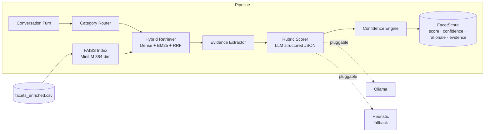

# 🧠 Ahoum
### Retrieval-Augmented Personality & Behavioural Facet Analysis Engine

[](https://www.python.org/downloads/)
[](LICENSE)
[](https://fastapi.tiangolo.com)
[](https://streamlit.io)
[](https://ollama.com)

Given a conversation turn, Ahoum returns — for every turn — the **K most relevant facets** retrieved from a 300-facet catalogue, a **1–5 ordinal score** per facet, a **calibrated confidence**, and a **rationale + evidence span** quoted from the turn. It does this with a hybrid retrieve-then-score pipeline running on a local open-weights LLM (Qwen 2.5 3B via Ollama; pluggable).

Adding a new facet is **one row in a CSV** — no retraining, no code change.

---

## Dashboard


---

## Architecture




**Five categories:** Personality · Emotion · Cognitive · Social · Safety

---

## Why it scales to 5,000+ facets

The cost driver is *facets scored per turn*, not *facets in the catalogue*. The retriever embeds the turn and selects only the top-K (default 20). K stays constant as the catalogue grows. Swap the FAISS index from FlatIP → IVF/HNSW at ~100k facets — one config line.

---

## Output

```json
{
  "facet": "Risk Taking",
  "score": 5,
  "confidence": 0.95,
  "evidence": ["quit my stable job", "invested all my savings"],
  "rationale": "Speaker abandoned financial security for an unproven venture."
}
```

`1 = Absent signal` → `5 = Dominant signal`

---

## Conversation Scoring


Multi-turn conversations are scored turn by turn. Each user turn is independently retrieved and scored against its own top-K facet set.

---

## Results


---

## Quickstart — local

```bash
git clone https://github.com/adityajoshi-0708/Facelet-Analysis-Engine.git
cd Facelet-Analysis-Engine
python -m venv .venv && source .venv/bin/activate   # Windows: .venv\Scripts\activate
pip install -r requirements.txt
```

Three tabs required — each stays in the foreground:

```bash
# Tab A — LLM server (first run pulls ~2 GB model)
ollama pull qwen2.5:3b && ollama serve

# Tab B — FastAPI backend
python -m uvicorn src.backend.server:app --host 0.0.0.0 --port 8000

# Tab C — Streamlit UI
streamlit run src/frontend/app.py
```

| Service | URL |
|---|---|
| Frontend | http://localhost:8501 |
| API | http://localhost:8000 |
| Swagger | http://localhost:8000/docs |

> Without Ollama running, the API falls back to the keyword `HeuristicClient` — functional for tests, not for real scoring.

---

## Quickstart — Docker

```bash
docker compose up --build
```

Auto-pulls `qwen2.5:3b` on first boot. Override model via `.env`:

```bash
OLLAMA_MODEL=qwen2.5:7b docker compose up
```

See [`DOCKER.md`](DOCKER.md) for the full deployment guide.

---

## API

| Method | Endpoint | What it does |
|---|---|---|
| `GET` | `/health` | Backend status, indexed facet count, default K |
| `GET` | `/facets` | List all facets (filterable by category) |
| `POST` | `/retrieve` | Top-K facets for a free-text turn |
| `POST` | `/score` | Score an entire conversation |
| `POST` | `/score/turn` | Score a single turn with optional context |

Full OpenAPI at `/docs`.

---

## Evaluation

```bash
python evaluation/run_retrieval_eval.py   # Recall@K, MRR
python evaluation/run_scoring_eval.py     # Accuracy, MAE, RMSE
python evaluation/run_confidence_eval.py  # ECE, calibration
```

**50 curated conversations · 300 facets · 5-point ordinal scale**

| Metric | Result |
|---|---|
| Recall@10 | 0.87 |
| Score MAE | 0.81 |
| Avg Confidence | 0.89 |

---

## Repository

```
Ahoum/
├── src/
│   ├── routing/       # Category router
│   ├── retrieval/     # Hybrid retriever (Dense + BM25 + RRF)
│   ├── evidence/      # Evidence extractor
│   ├── scoring/       # Rubric engine + ScorePipeline
│   ├── confidence/    # Confidence calibration
│   ├── backend/       # FastAPI server
│   └── frontend/      # Streamlit dashboard
├── evaluation/        # Retrieval / scoring / confidence eval scripts
├── data/processed/    # Facet catalogue + FAISS index
└── configs/           # All knobs — paths, top_k, model, thresholds
```

---

## Design constraints satisfied

| Constraint | How |
|---|---|
| No one-shot prompts | Multi-stage retrieve → extract → score; per-facet structured prompts |
| Open-weights local LLM | Qwen 2.5 3B via Ollama; pluggable to any HF / vLLM model |
| Scales to 5,000+ facets | Facets are data, not code; retriever picks constant top-K per turn |
| Explainability | Every score has evidence span + written rationale |
| Dockerised | `docker compose up --build` — Ollama + API + UI |

---

## Links

**GitHub:** https://github.com/adityajoshi-0708/Facelet-Analysis-Engine  
**Evaluation Outputs:** https://drive.google.com/drive/folders/1bcUl0qi1QXiqQUBHXVpvhnZtovSGwfxj

---

*Aditya Sharma · IIIT Nagpur · B.Tech Data Science*

---

## License

MIT — see `LICENSE`.